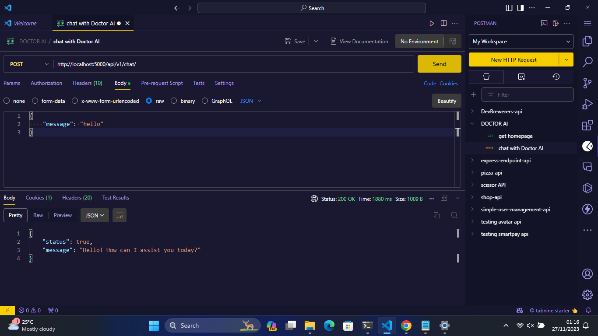
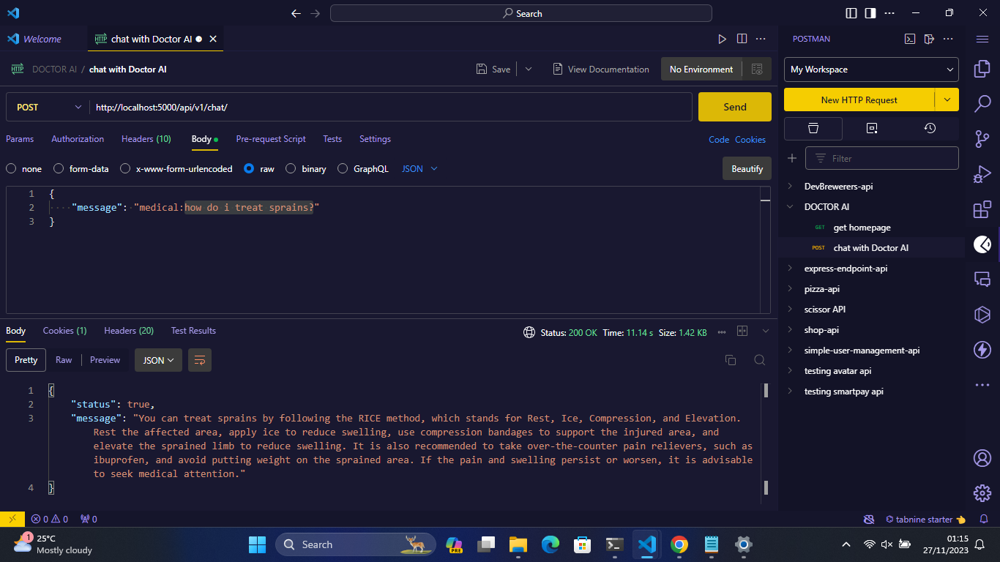

# DOCTOR AI - whisper your health defects into my ears :)

The Doctor AI api is dedicated towards receiving user's input (symptoms) and returning medical advices. But, it's able to have friendly and nice chats too 😊. Just that there are entirely different ways to start chats medically or friendly - Discussed down there 👇 at **API Endpoints** section.

**Built with** - ExpressJs, LangChain, OpenAI, BingSerpAPI, Wolfram Alpha, Wikipedia, DuckDuckGo

### Features (current version - v1)
- receives user's input (symptom)
- think deeply
- return medical advices.

### Installation
1. Clone the repository:
```bash
git clone git@github.com:Group-147/Doctor-AI-api.git
cd Doctor-AI-api
```

2. Install the dependencies:
```bash
npm install
```

3. Create a `.env` file in the root directory, check `.env.example` for the template of the keys or values needed

4. Start the server:
```bash
npm run dev
```

### API Endpoints
**Signup URL**
- Endpoint: /api/v1/chat/
- Method: POST
- **As for the request body**
  - **Friendly** - start normally or anyhow (don't be abusive 😂)
  `{"message": "hello"}`
  
  - **Medically** - make sure the request body starts with **medical:**
  `{"message": "medical: how do i treat sprains?"}`
  

Other routes and features will be released with the second version - v2 😁

- Handling user data and preferences,
- Providing more effective and accurate answers,
- Processing and Providing audio-visuals inputs, etc. 

### Meet The Developers
- [Precious]() - Product manager
- [Faridah Ejibunu]() - Product designer
- [Samuel Happiness]() - Mobile Developer
- [Oluwadarasimi]() - AI/ML Engineer
- [Faruq]() - Designer
- [Abdussalam Mujeeb-ur-rahman]() - Backend Developer